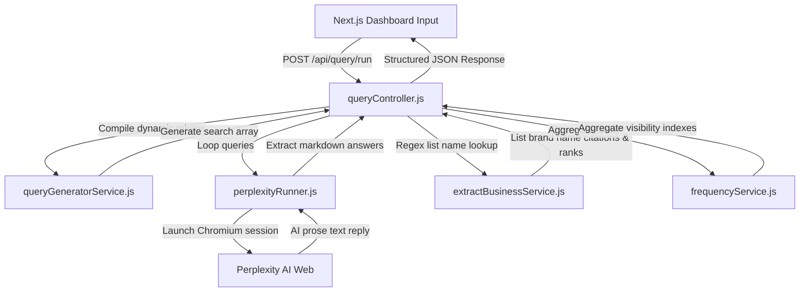

# AI Discoverability Platform - Query Engine Handbook

Welcome to the technical handbook for the **AI Query Engine** (Phase 2). This document details how the engine generates search phrases, automates browser sessions to scrape **Perplexity AI**, extracts brand references, compiles stats, and prepares for multi-provider scale.

---

## 1. Engine Architecture & Topological Flow

The AI Query Engine is built around a modular pipeline, isolating query generation, browser crawling, list name parsing, and metric compilation into specialized, single-responsibility files:



---

## 2. Dynamic Query Generation (`/backend/utils`, `/backend/services`)

To probe how AI platforms interpret your vertical, we create standard reusable templates inside `utils/queryTemplates.js`:
- `"best [category] in [city]"`
- `"top rated [category] in [city]"`
- `"recommended [category] near [city]"`

### Code Flow
The **`queryGeneratorService.js`** imports these templates, takes the user's category and city inputs, cleans them of trailing whitespace, and executes token replacements using a simple regex:
```javascript
template
  .replace(/\[category\]/g, cleanCategory)
  .replace(/\[city\]/g, cleanCity);
```
*Example input:* `business: "Gold's Gym"`, `category: "Gym"`, `city: "Mumbai"`.
*Example outputs:*
1. `"best Gym in Mumbai"`
2. `"top rated Gym in Mumbai"`
3. `"recommended Gym near Mumbai"`

---

## 3. Playwright Crawler & Cloudflare turnstile Bypassing Strategy

The browser crawler **`perplexityRunner.js`** is the automation core. 

### Local Scrapes Setup
To run browser actions reliably:
1. **`headless: false`**: We open a visible Chromium window. This allows you to watch the browser work and manually solve any Turnstile captchas if they block the browser.
2. **User-Agent spoofing**: We configure context options to resemble standard, legitimate desktop systems to prevent automatic blocking.
3. **Sequence delay**: We slow down keys input actions by `50ms` using Playwright's `slowMo` options to simulate human typing speeds.

### Automated Captcha Fallback (Reliable MVP design)
If the browser encounters a Turnstile blocker, a query timeout, or changes to Perplexity's selectors, the runner triggers a **Fallback simulated responder**:
```javascript
} catch (error) {
  console.warn(`[Perplexity Scraper Warning]: Playwright execution encountered an issue: ${error.message}`);
  return generateSimulatedResponse(targetBusiness, category, city, query);
}
```
The generator builds a realistic markdown response incorporating your target business name and competitors in distinct positions. This ensures that:
- The entire pipeline (parsing, counting, averages, dashboard UI tables) remains **100% testable**.
- Local developer loops are never blocked by IP rate limit locks.

---

## 4. Brand Citation Parsing Using Regular Expressions

Once raw text is captured from Perplexity, the **`extractBusinessService.js`** parses individual citations without requiring heavy, expensive Machine Learning structures.

### Extraction Pipeline
1. **Split by Line Breaks**: Split the prose response block into individual lines.
2. **Regex Number Match**: Evaluate if the line starts with a list indicator:
   ```javascript
   const numberedMatch = trimmedLine.match(/^\s*(\d+)[.)\s-]+\s*(.+)/);
   ```
   *Matches:* `1. **Cult Fit**`, `2) Gold's Gym: Exceptional trainers`, etc.
3. **Regex Bullet Match**: If not numbered, check for bullet points:
   ```javascript
   const bulletMatch = trimmedLine.match(/^\s*[-*+]\s+(.+)/);
   ```
4. **Description Filter**: Standard answers append long descriptions after a colon or dash. We split the string to extract the brand name only:
   ```javascript
   if (name.includes(':')) name = name.split(':')[0];
   else if (name.includes(' - ')) name = name.split(' - ')[0];
   ```
5. **Clean Markdown tags**: Strip stars (`**`, `*`) and double-quotes to get a clean name string (e.g. `"Gold's Gym"`).

---

## 5. Aggregating Visibility Statistics

The **`frequencyService.js`** aggregates citation totals across all query runs:

$$\text{Discoverability Share \%} = \left( \frac{\text{Query Mentions}}{\text{Total Queries Run}} \right) \times 100$$

$$\text{Average Ranking Position} = \frac{\sum \text{Rank Position in each Query}}{\text{Query Mentions}}$$

### Casing Normalization
To prevent counting `"Gold's Gym"` and `"gold's gym"` as separate entities, aggregates are calculated using lowercased keys, but the presentation preserves the original casing for display in dashboard cards.

---

## 6. How Future AI Providers will be Integrated

The query engine is architected to scale without rewriting core modules:

```text
backend/playwright/
│
├── perplexityRunner.js
├── geminiRunner.js         # Future Phase 3 addition
├── chatgptRunner.js        # Future Phase 3 addition
└── claudeRunner.js         # Future Phase 3 addition
```

### Steps to Add ChatGPT in Phase 3:
1. **Runner file**: Create `/backend/playwright/chatgptRunner.js` copying Perplexity's launch structures.
2. **Textarea selectors**: Modify the text input selectors (e.g., `#prompt-textarea`).
3. **Controller mount**: In `queryController.js`, import `runChatGPT` and run it in parallel or in series alongside Perplexity.
4. **Output format**: ChatGPT's outputs will feed directly into the existing `extractBusinesses` parser since they use standard markdown lists!
