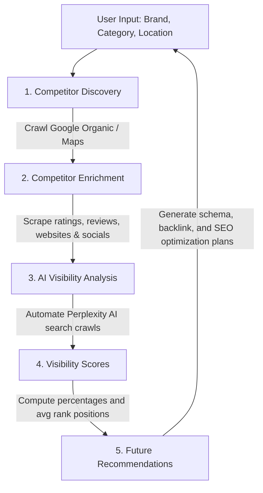

# AI Visibility Analysis Engine (GEO Engine)

Welcome to the technical handbook for the **AI Visibility Analysis Engine** (Phase 8). This module helps modern businesses understand their discoverability within LLM search engines. This is the core foundation of **GEO (Generative Engine Optimization)**.

---

## 1. Executive Summary: Why AI Visibility and GEO Matter

### Why Businesses Care About AI Recommendations
Traditional Search Engine Optimization (SEO) focuses on ranking links on page 1 of Google. However, search behavior is changing rapidly. Millions of consumers now ask AI engines like **Perplexity**, **ChatGPT**, **Gemini**, and **Claude** questions like:
- *"What is the best strength gym near Vikhroli, Mumbai?"*
- *"Which coffee shops in Manhattan are friendly for working?"*

AI engines do not return pages of links; they synthesize search results into a single, cohesive prose answer, citing specific brands.
- If your business is cited and recommended, you get high-quality warm leads.
- If you are left out, you are invisible to this entire segment of consumers.

### What is GEO?
**GEO (Generative Engine Optimization)** is the science of optimizing your brand's digital presence (websites, reviews, schemas, backlink citations) to increase the likelihood that Large Language Models will select and cite your business in their answers.

---

## 2. Platform Data Flow Diagram

The platform operates in consecutive phases, moving from initial keyword mapping to final recommendation insights:



---

## 3. Architecture Overview & File Map

The AI Visibility Analysis Engine is built with modular components in the backend, isolated REST API controllers, and interactive React cards on the frontend dashboard:

```text
backend/
├── ai-visibility/
│   ├── queryGenerator.js       # Category/location prompt compiler
│   ├── perplexityRunner.js     # Playwright automation crawler (headed + session reuse)
│   ├── responseExtractor.js    # Prose text and source link parser
│   ├── mentionDetector.js      # Deterministic case-insensitive string matcher
│   ├── visibilityCalculator.js # Share of voice and average ranking calculator
│   └── aiVisibilityStorage.js  # Supabase and offline JSON persistence manager
├── controllers/
│   └── aiVisibilityController.js # API Request validator and runner wrapper
└── routes/
    └── api.js                  # Mounts the POST /api/ai-visibility/run route

frontend/
├── src/
│   ├── services/
│   │   └── api.js              # Registers React runAIVisibility caller
│   ├── context/
│   │   └── DashboardContext.js # Tracks scanning states, results, and logs
│   └── components/
│       ├── shared/
│       │   └── Sidebar.js      # Adds AI Visibility tab to navigation links
│       └── dashboard/
│           └── AIVisibilityView.js # Renders insights cards, tables, and debugger
```

---

## 4. Technical Workflow Deep-Dive

### Step 1: AI Query Generation (`queryGenerator.js`)
To simulate real user queries, we convert basic category and location tokens into conversational phrases.
- **Category-Aware Pluralization**: Automatically converts "Gym" to "Gyms", "Cafe" to "Cafes", "Dentist" to "Dentists", etc.
- **Synonym Mapping**: Interchanges core terms to probe broader AI embeddings (e.g., "Gym" -> "Fitness Centers").
- *Result:* For `Gym` in `Vikhroli, Mumbai`, it returns:
  1. `best gym in Vikhroli, Mumbai`
  2. `top fitness centers in Vikhroli, Mumbai`
  3. `affordable gyms in Vikhroli, Mumbai`
  4. `best beginner gym in Vikhroli, Mumbai`
  5. `recommended gyms in Vikhroli, Mumbai`

### Step 2: Perplexity Automation & Session Reuse (`perplexityRunner.js`)
We use Playwright to simulate a human user browsing Perplexity:
- **Headed Debugging (`headless: false`)**: Displays the Chromium browser on screen, enabling visual debugging and manual bypass of Cloudflare Turnstile barriers if required.
- **Browser Context Reuse**: Keeps a single browser session active across all 5 queries, eliminating the overhead of launching Chromium multiple times.
- **Automated Anti-Bot Fallback**: If browser calls fail (e.g., Turnstile challenge blocks script or network times out), the runner catches the error, logs a warning, and fires a **high-fidelity local simulator** to generate a realistic markdown response. This guarantees the scoring pipeline and UI remain 100% testable at all times.

### Step 3: Response Extraction (`responseExtractor.js`)
Filters raw Playwright outputs to package a structured payload:
```json
{
  "query": "best gym in Vikhroli",
  "response": "Here are the top gyms...",
  "sources": ["https://goldsgym.in", "https://cult.fit"],
  "extractedAt": "2026-06-14T12:00:00Z"
}
```

### Step 4: Business Mention Detection (`mentionDetector.js`)
To remain fast and cost-effective, we do not use an LLM for mention detection. Instead, we scan the text using deterministic, case-insensitive string matching:
1. Scan response text for the target brand and each competitor name.
2. If mentioned, record the index of its first character appearance.
3. Sort mentioned brands by their index ascending. The brand appearing closest to the top gets **position 1**, the next **position 2**, and so on.

### Step 5: Visibility Calculator (`visibilityCalculator.js`)
Aggregates query-level mention details to compile three main metrics for each business:
- **Mention Count**: Total queries where the business was recommended.
- **Visibility Percentage**: Share of voice across search queries.
  
  $$\text{Visibility \%} = \left( \frac{\text{Citations Count}}{\text{Total Queries Run}} \right) \times 100$$
  
- **Average Position**: Average rank ranking position when mentioned.

---

## 5. Database Structure

Individual search logs are written to the database to preserve historical GEO tracking data.

### Postgres / Supabase Table Definition (`ai_visibility_results`)
```sql
CREATE TABLE IF NOT EXISTS ai_visibility_results (
    id UUID PRIMARY KEY DEFAULT uuid_generate_v4(),
    business_name VARCHAR(255) NOT NULL,
    query VARCHAR(255) NOT NULL,
    mentioned BOOLEAN NOT NULL DEFAULT FALSE,
    position INT, -- Nullable, remains NULL if brand is not cited
    response_text TEXT,
    source_links JSONB DEFAULT '[]'::jsonb,
    visibility_score INT CHECK (visibility_score >= 0 AND visibility_score <= 100),
    created_at TIMESTAMP WITH TIME ZONE DEFAULT CURRENT_TIMESTAMP
);
CREATE INDEX IF NOT EXISTS idx_ai_visibility_results_business ON ai_visibility_results(business_name);
```

### Local Offline JSON Fallback
If Supabase keys are not configured, database operations fall back automatically to a local document-store JSON file at `backend/data/ai_visibility_results.json`:
```json
[
  {
    "id": "vi_sjl8n13_4020",
    "business_name": "Be Strong Gym",
    "query": "best gym in Vikhroli, Mumbai",
    "mentioned": false,
    "position": null,
    "response_text": "Based on local recommendations...",
    "source_links": ["https://goldsgym.in"],
    "visibility_score": 0,
    "created_at": "2026-06-14T12:00:00.000Z"
  }
]
```

---

## 6. Future Scalability: Adding ChatGPT, Gemini, and Claude

The platform is designed to scale horizontally to support new AI engines without major rewrites.

### Adding ChatGPT
1. **Runner file**: Create `backend/ai-visibility/chatgptRunner.js` copying the persistent browser launch structures from `perplexityRunner.js`.
2. **Textarea selectors**: Modify the text input selectors (e.g. `textarea#prompt-textarea`).
3. **Orchestrator Mount**: In `aiVisibilityEngine.js`, import `runChatGPT` and run it in parallel or series with Perplexity.
4. **Extraction**: The existing markdown prose extractor will work seamlessly since ChatGPT outputs answers in standard bulleted or numbered markdown blocks.
