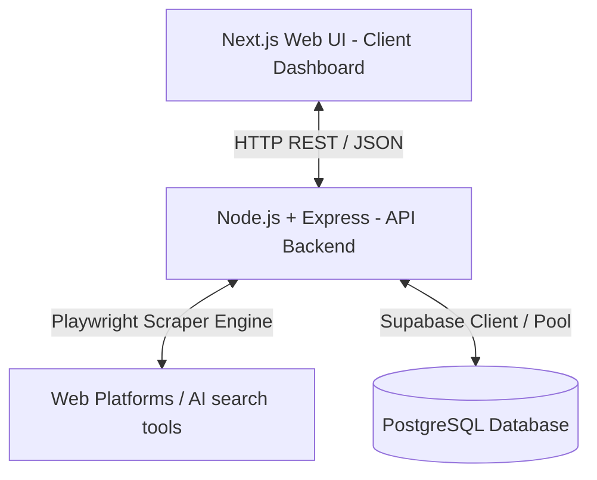
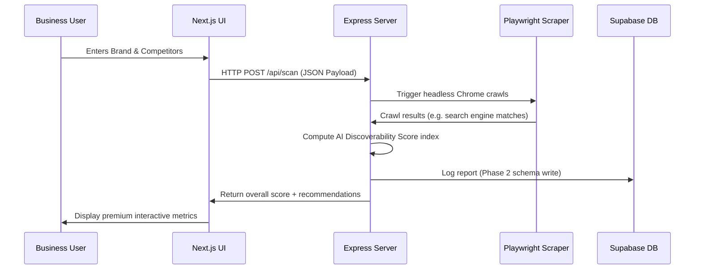

# AI Discoverability Platform - Architecture Overview

This document provides a conceptual walkthrough of the **AI Discoverability Platform** (Phase 1). It outlines the structural design, communication layers, and integration blueprints, establishing a premium, scalable base that is straightforward for a beginner to understand.

---

## 1. Architectural Blueprint (System Topology)

The platform is designed around a decoupled **Client-Server architecture** (often called a decoupled Monorepo structure) using clean, specialized modules instead of over-engineered microservices.



### Component Breakdown
1. **Frontend (`/frontend`)**: Built with **Next.js (App Router)**. Delivers client pages, captures business parameters, and formats visibility scores.
2. **Backend (`/backend`)**: Built with **Node.js & Express**. Handles HTTP requests, runs the Playwright browser scrapers, computes the AI Discoverability score indexes, and formats the output data.
3. **Database Layer (`/database`)**: Configured for **Supabase PostgreSQL**. Retains historical scans, competitor rankings, and user profiles.

---

## 2. Technology Selection Rationale (Why these tools?)

We avoided overly complex multi-cloud configurations and microservices, prioritizing a clean, single-stack MVP that scales efficiently.

| Technology | Purpose | Why Chosen? |
| :--- | :--- | :--- |
| **Next.js (App Router)** | Frontend Framework | Fast server-side rendering, search engine optimization (SEO) best-practices by default, clean nested routing, and fast initial loads. |
| **Tailwind CSS** | Design & Aesthetics | Atomic design utilities, zero-runtime overhead, rapid development, and high control over dynamic responsive states. |
| **Node.js + Express** | Core REST API Server | Ultra-lightweight REST routing, massive npm package ecosystem, fully asynchronous runtime matching CPU-heavy Playwright needs. |
| **Playwright** | Crawling & Automation | Industry-grade headless browser controls, far more resilient and faster than Selenium or Puppeteer, with modern auto-wait execution. |
| **Supabase (PostgreSQL)** | Database Platform | Cloud-hosted enterprise PostgreSQL, integrated auto-generated REST APIs, simple schema migrations, and user auth management. |

---

## 3. Communication Protocols & Core Data Flows

### A. Scanning & Scoring Pipeline Flow
This is the sequence when a business inputs a brand name into the search form:



### B. Security & CORS Design
To prevent cross-site scripting vulnerabilities, the Express server uses the `cors` library to restrict requests. Only requests coming from the registered `FRONTEND_URL` (local development at `http://localhost:3000`) are accepted.

---

## 4. Phase 2 Database & Supabase Integration Blueprint

During Phase 1, we defined a placeholder database connection in `/database/connection.js` and a SQL relational design schema in `/database/schema.sql`.

### How integration will happen in Phase 2:
1. **Supabase client library**: Install `@supabase/supabase-js` inside the backend.
2. **Schema setup**: Paste the contents of `database/schema.sql` into the SQL Editor of your Supabase Workspace to generate all tables (`users`, `businesses`, `visibility_reports`, `competitors`).
3. **Connection setup**: Enable the DB connection inside `database/connection.js` by providing your active Supabase URL and Keys.
4. **Data read/writes**: In your Express controllers (e.g. `/api/scan`), write the results of each discoverability audit directly into the database:
   ```javascript
   const { data, error } = await supabase
     .from('visibility_reports')
     .insert([{ business_id, overall_score, chatgpt_score, claude_score }]);
   ```

---

## 5. Playwright Architecture inside Backend

Playwright is placed directly inside `/backend/playwright`.
- **Isolation**: Runs fully decoupled from the Express request-response loop if needed, or inline.
- **Local Sandbox**: Launches a headless browser local context instance (`chromium.launch({ headless: true })`) to navigate websites, avoiding detection blocks.
- **Future Scalability**: In Phase 2, we will create scrapers for ChatGPT/Claude web interfaces. By using Playwright, we can scrape how LLMs answer questions like: *"What is the best CRM software for startups?"* and check if the user's business brand is cited.

---

## 6. Future Scalability Considerations

As the startup grows, you can scale the base architecture without rewriting from scratch:
1. **Background Job Queue**: Scraping can take 5–15 seconds. In the future, rather than doing this in a synchronous HTTP request, move scanning to a background queue system using **BullMQ** or **Redis**. The user submits a scan -> the backend registers it in the queue -> returns a 202 Accepted status -> the background worker handles the Playwright scraping -> saves to Supabase -> notifies the user via WebSockets.
2. **Database Connection Pooler**: Direct PostgreSQL connections can run out if there is high traffic. Supabase provides **Supavisor** (a connection pooler) out of the box. Switching from standard `DATABASE_URL` to the pooled connection string handles high concurrent spikes.
