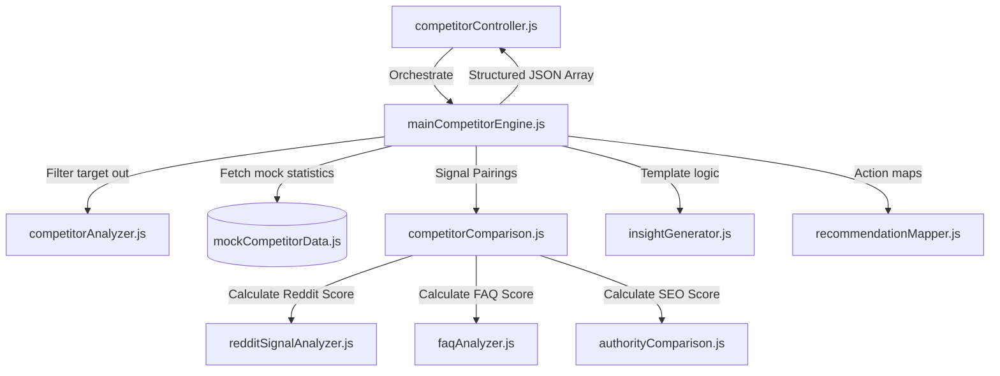

# AI Discoverability Platform - Competitor Analysis Handbook

Welcome to the technical handbook for the **Competitor Analysis System** (Phase 4). This document details how we identify competitor businesses mentioned in search crawls, pair up reputation indicators, heuristically score community/content trust, and generate human-readable explanations detailing: **"Why do competitors rank higher?"**

---

## 1. System Architecture & Modular Design

The Competitor Analysis Engine is decoupled from core server loops, implementing isolated comparison rules to calculate ratios side-by-side:

### Component Breakdown
1. **`competitorAnalyzer.js`**: Analyzes the live `frequencyData` generated by Perplexity crawls. It filters out the target business name, removes duplicates, and lists competitors in order of their citation frequency.
2. **`competitorComparison.js`**: Combines target and competitor statistics side-by-side into a comparison matrix, determining who is "better" in each signal category.
3. **`insightGenerator.js`**: Takes the comparison matrix and evaluates strengths. For every competitor strength, it compiles human-readable explainability templates (e.g. `"Has 2.5x more Google reviews than your business"`).
4. **`recommendationMapper.js`**: Automatically maps gaps to specific tasks (e.g. if the competitor has more reviews $\rightarrow$ recommendations suggest review campaigns).

---

## 2. Reddit Community Signal Heuristic Analyzer

AI search engines (especially Google and Perplexity) index forums like **Reddit** to identify trusted products and popular local brands. The **`redditSignalAnalyzer.js`** evaluates these community trust signals:
- **Citations Volume**: Measures thread mention frequency (up to 25 threads for full points).
- **Sentiment Index**: Compiles positive thread sentiment ratio (0.0 to 1.0).

$$\text{Reddit Trust Score} = (\text{Volume Score} \times 0.40) + (\text{Sentiment Score} \times 0.60)$$

---

## 3. Conversational content (FAQ) Heuristic Analyzer

LLM semantic indexers crawl website pages for **Question-Answer patterns** to parse exact answers when users submit questions like *"Do gyms in Mumbai offer trial passes?"*. The **`faqAnalyzer.js`** evaluates conversational site structures:
- Base Q&A page/section presence: `+40 base points`
- Total Question-Answer Density: awards `min(30, count * 3)` (up to 10 questions for full 30 points)
- FAQPage JSON-LD schema markup active: `+30 points`

$$\text{Conversational FAQ Score} = \text{Base (40)} + \text{Density Score (30)} + \text{Schema (30)}$$

---

## 4. Rule-Based Insight & Template Generator

To make scores highly transparent and explainable, **`insightGenerator.js`** runs dynamic comparison math:

### Review Ratios
If competitor review count is higher than target:
- If target has reviews: `compCount / targetCount`
  *Insight:* `"Has 2.5x more Google reviews than your business (2200 vs 800 reviews)"`
- If target has zero reviews:
  *Insight:* `"Has 2200 Google reviews establishing trust, while you have none"`

### AI Search Mentions Gaps
If competitor mentions count is higher than target:
  *Insight:* `"Appears more frequently in AI search query responses (9 vs 4 mentions)"`

### FAQ Content Gaps
If competitor has structured conversational FAQ pages:
  *Insight:* `"Website contains structured conversational FAQ sections, while your homepage lacks Q&A blocks"`

---

## 5. Future Scalability: Signals Expansion

The competitor comparison engine is architected to support future channels:
- **X/Twitter Sentiment Scans**: Analyze competitor real-time sentiment shifts on Twitter, adding a `TwitterScore` module.
- **YouTube Citations**: Scan mentions in tech/brand catalogs, adding a `VideoScore` module.
- **LinkedIn Authority**: Index B2B authority indicators for corporate target listings.
