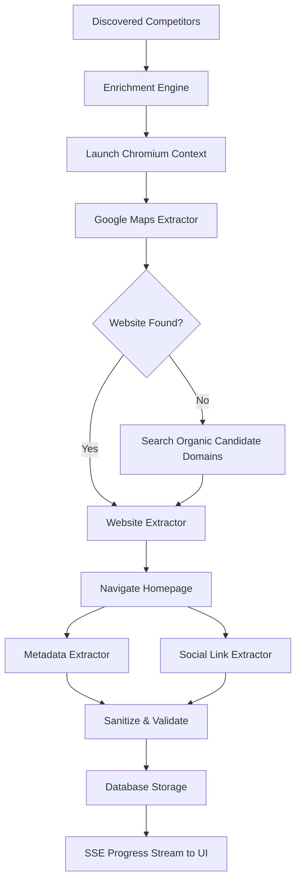

# Competitor Intelligence Enrichment - Documentation

This document describes the design, architecture, and workflow of the **Competitor Intelligence Enrichment Layer** (Phase 7).

---

## 1. Overview & Goal

The Competitor Intelligence Enrichment Layer is a modular, high-fidelity pipeline built on top of the competitor discovery system. Rather than just finding competitor business names, the enrichment layer gathers complete public profiles including ratings, review counts, descriptions, domains, phone numbers, and social media handles. 

This intelligence forms the structural baseline for calculating visibility indexes, discovering organic optimization gaps, and generating recommendations.

```text
  Competitor Discovery ──> Enrichment (Playwright) ──> Storage (Supabase/JSON) ──> Future AI Analysis
```

---

## 2. Enrichment Architecture

The enrichment modules reside under `backend/enrichment/`:

```text
backend/enrichment/
├── competitorEnrichmentEngine.js   # Orchestrator coordinator
├── googleMapsExtractor.js          # Google Maps & Profile details scraper
├── websiteExtractor.js             # Website URL and domain resolver
├── metadataExtractor.js            # Title tag & description scraper
├── socialLinkExtractor.js          # Homepage social media link finder
├── enrichmentValidator.js          # Rating, reviews, and URL validator
├── enrichmentLogger.js             # Session state & stream log builder
└── enrichmentUtils.js              # Parsing, formatting, and sleep helper utils
```

### Data Flow Diagram



---

## 3. Extraction Flow Descriptions

### Google Maps Extraction Flow
1. Receives business name and location coordinates (e.g. `"Copper Chimney"`, `"Powai"`).
2. Performs a search for `"${name} ${location}"` in a shared Chromium browser context.
3. Inspects the search results and parses the Google Knowledge Graph panel (`div#rhs`, `div.VkpGBb`).
4. Extracts ratings (`4.5`), review counts (`5200`), address, category, phone number, direction link, and website button url.
5. Employs zero mock fallback ratings: if a field is missing, it stays `null`.

### Website Extraction Flow
1. If Google Business listing exposes a website, verifies that it is not a listing directory (such as Yelp, TripAdvisor, or Zomato).
2. If no website is visible in the panel, scans the organic search result headers (`h3`).
3. Picks the first non-directory candidate link matching the business identity.

### Social Link Extraction Flow
1. Navigates the browser to the resolved official website homepage with a strict timeout (12s).
2. Evaluates the loaded HTML, extracting all `href` attributes on anchors (`a` tags).
3. Matches targets against regular expressions for: Instagram, Facebook, LinkedIn, YouTube, and X/Twitter.
4. Sanitizes and groups verified profile links.

---

## 4. Database Structure Explanation

Table: **`competitor_profiles`**

This table stores enriched physical details. If Supabase is unconfigured, the system appends profiles locally at `backend/data/competitor_profiles.json` maintaining schema parity.

| Field Name | Type | Description |
| :--- | :--- | :--- |
| `id` | `UUID` / `String` | Primary Key (auto-generated) |
| `name` | `VARCHAR(255)` | Competitor brand name (Not Null) |
| `category` | `VARCHAR(100)` | Business vertical category |
| `rating` | `NUMERIC(3,2)` | Google Maps star rating (1.0 to 5.0) |
| `review_count`| `INT` | Total Google reviews count |
| `website` | `VARCHAR(255)` | Official verified homepage link |
| `description` | `TEXT` | Merged Google summary & website meta description |
| `address` | `TEXT` | Physical street address |
| `phone` | `VARCHAR(50)` | Telephone contact string |
| `google_maps_link`| `TEXT` | Google Maps listing direction URL |
| `social_links`| `JSONB` | Platform dictionary (e.g., `{ "instagram": "..." }`) |
| `source_query`| `VARCHAR(255)`| Discovery search query trigger |
| `created_at` | `TIMESTAMP` | Extracted creation timestamp |
| `updated_at` | `TIMESTAMP` | Profile modification timestamp |

---

## 5. Frontend Integration

### Progress Tracking
Enrichment runs as a sequential, multi-step pipeline. The frontend uses a Server-Sent Events (SSE) connection mapping to `POST /api/competitors/enrich/stream` to receive real-time updates.
During the process, the dashboard displays:
- **Active Competitor**: The name of the brand currently being scraped (e.g., `Copper Chimney`).
- **Progress Gauge**: A percentage bar showing index progress (e.g., `3/7 Completed`).
- **Crawler Status**: Human-readable steps (e.g., "Scanning Website Metadata & Socials...").
- **Live Details Grid**: Scraped attributes updated instantly.
- **Log Terminal Console**: A scrolling window printing browser console crawls.

### Enriched Competitor Cards
Once completed, cards render the complete profile:
- Review stars and total reviews count.
- Contact tags (address, telephone).
- Website hyperlink and Maps navigation launcher.
- Direct links to discovered social profiles.
- A "View Profile Details" link directing to `/competitor/[id]`.

### Competitor Details Page (`/competitor/:id`)
A page layout displaying:
- Complete Business Profile header.
- Interactive contact hubs (maps launcher, tel link).
- Discovered Social Media handles.
- Full business description merge.
- **AI Readiness Widget**: Previews discoverability scores, presence indicators, and lists optimization advice.

---

## 6. Important Files & Functions Overview

### Backend Orchestration
- **`competitorEnrichmentEngine.js`**
  - `enrichCompetitors(competitors, sourceQuery, logger, onProgressUpdate)`: Launches Chromium, loops competitors sequentially, runs extractors, sanitizes parameters, saves data, and fires streaming callbacks.
- **`competitorEnrichmentController.js`**
  - `streamEnrichment(req, res, next)`: Initiates SSE headers, starts enrichment, and writes formatted JSON data blocks to the active socket.
- **`competitorProfileService.js`**
  - `saveEnrichedProfile(profile)`: Selects by name to update or insert profiles in Supabase or local JSON.

---

## 7. Error Handling Strategy

1. **Website Failures**: If a competitor's website fails to load due to connection timeout (12s) or TLS errors, the engine logs it, skips social crawling, and falls back to using Google snippet descriptions. The overall pipeline does not crash.
2. **Missing Properties**: If no rating or reviews are visible, they are saved as `null`. No fake values are simulated.
3. **CAPTCHA Wall**: If Google blocks queries with a CAPTCHA, the logs update with an error alert, the page skips to the next competitor, and partial data remains preserved.

---

## 8. Preparation for AI Visibility Analysis

### Why Enrichment is Required Before Scoring
Traditional search engines look at keywords. AI search models (like SearchGPT, Gemini, and Perplexity) act as recommendation synthesizers. They read reviews, check site metadata, scan backlink citations, and read local profile listings. We cannot score a brand's visibility without knowing these authority metrics first.

### Why Ratings/Reviews Matter
High ratings and large review counts indicate customer trust. LLMs are trained to recommend highly-rated and popular businesses to satisfy user intents. A competitor with `5,000` reviews at `4.8` rating is far more likely to be selected by an AI agent than a competitor with `10` reviews.

### Improving Recommendation Quality
By storing clean structured competitor descriptions, address ranges, and socials, we can later submit precise gaps:
- "Competitor A is mentioned on Instagram and has active schema descriptors; you lack Instagram linkage."
- "Competitor B is recommended in Powai because their meta description maps target keywords; update your homepage tags to match."
This fuels the recommendation engine with real, actionable data.
