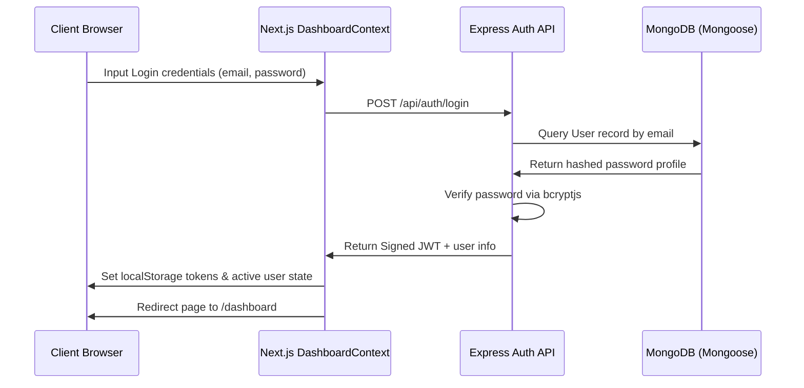

# AI Discoverability Platform - Dashboard & Authentication Architecture

This document describes the design, implementation, and APIs of the **User Authentication** and the **SaaS Dashboard** modules added to the platform.

---

## 1. Authentication Flow (JWT)

To ensure secure, isolated business performance tracking, a state-of-purpose **JWT Authentication** flow is integrated into the backend and frontend components.



### Authorization Protection
- **Backend Protection**: Incoming requests to `/api/dashboard/*` and `/api/ai-visibility/*` endpoints pass through the `protect` middleware (`backend/middleware/authMiddleware.js`), which parses the `Authorization: Bearer <token>` header, decodes the JWT, and attaches the active Mongoose User profile to the Express request object (`req.user`).
- **Frontend Protection**: The Next.js routing wrapper `DashboardContext.js` checks for credentials (`auth-token`) inside a mounting `useEffect` loop. If missing, it immediately redirects the browser path to `/login`.

---

## 2. Database Models (MongoDB via Mongoose)

The platform utilizes two core MongoDB collections via Mongoose models:

### A. User Model (`backend/models/User.js`)
Stores user profiles and handles security hashing.
- `name` (String, required, trimmed)
- `email` (String, required, unique, validated email format)
- `password` (String, hashed using `bcryptjs` in a pre-save Mongoose hook)
- `createdAt` (Date, defaults to `Date.now`)

### B. VisibilityHistory Model (`backend/models/VisibilityHistory.js`)
Saves snapshots of visibility crawls.
- `userId` (Mongoose Schema ObjectId, ref: 'User')
- `businessName` (String, required)
- `category` (String, required)
- `location` (String, required)
- `scanDate` (Date, default `Date.now`)
- `overallVisibility` (Number, 0-100)
- `platforms`:
  - `chatgpt` (Number)
  - `gemini` (Number)
  - `perplexity` (Number)
- `competitors`: Array of objects containing `{ name, visibility, averagePosition }`

---

## 3. Dashboard API Endpoints

### 1. GET `/api/dashboard`
Fetches a high-level summary of business performance.
- **Access**: Protected (JWT token required)
- **Response Shape**:
  ```json
  {
    "success": true,
    "businessName": "Be Strong Gym",
    "overallScore": 62,
    "weeklyChange": 8,
    "monthlyChange": 17,
    "lastScanDate": "2026-06-27T13:35:01.000Z",
    "platforms": {
      "chatgpt": { "score": 52, "previous": 43, "growth": 9 },
      "gemini": { "score": 45, "previous": 45, "growth": 0 },
      "perplexity": { "score": 89, "previous": 80, "growth": 9 }
    },
    "insights": [
      "Your AI visibility improved by 17% this month.",
      "Perplexity is your strongest platform."
    ]
  }
  ```

### 2. GET `/api/dashboard/history`
Returns up to the last 10 historical scans.
- **Access**: Protected (JWT token required)
- **Response Shape**:
  ```json
  {
    "success": true,
    "history": [
      {
        "id": "603d2b...",
        "date": "2026-06-27T13:35:01.000Z",
        "overallVisibility": 62,
        "platforms": { "chatgpt": 52, "gemini": 45, "perplexity": 89 }
      }
    ]
  }
  ```

### 3. GET `/api/dashboard/trends`
Provides chronological visibility coordinates.
- **Access**: Protected (JWT token required)
- **Query Parameter**: `period` (`7days`, `30days`, `90days`, `year`)
- **Response Shape**:
  ```json
  {
    "success": true,
    "trends": [
      { "date": "Jun 21", "visibility": 55 },
      { "date": "Jun 27", "visibility": 62 }
    ]
  }
  ```

---

## 4. Trend & Growth Calculations

The dashboard calculates changes dynamically by comparing the latest scan to previous ones in MongoDB:
1. **Weekly Change**: Compares `overallVisibility` in the most recent scan (`scans[0]`) to the second most recent scan (`scans[1]`).
2. **Monthly Change**: Iterates back in time to locate the first scan that is at least 30 days older than the current date. If none exists, it falls back to the oldest scan in the user's history database.
3. **Platform Growth**: Subtracts the platform's visibility score in the previous scan from its score in the latest scan.
4. **Insights Engine**: Evaluates these growth figures against simple logical thresholds to provide clean advice, such as *"ChatGPT visibility increased compared to last week."*
