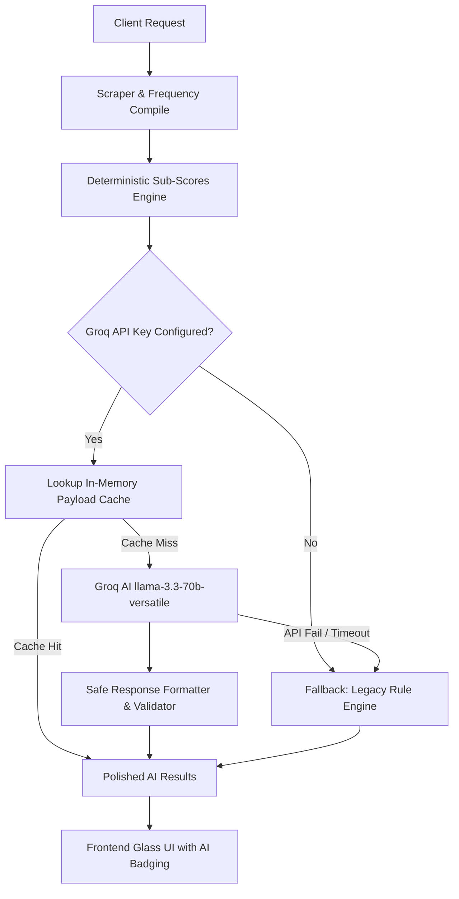

# Hybrid AI Architecture Specification (Groq Integration)

This document details the design, engineering choices, and deployment patterns of the **Hybrid AI Architecture** implemented for the AI Discoverability Platform.

---

## 1. Architectural Overview

The AI Discoverability Platform utilizes a **Hybrid AI Architecture** to combine the absolute precision of deterministic data calculations with the cognitive, reasoning, and communicative strengths of Large Language Models (LLMs).



### Why a Hybrid Model is Better than Pure AI
1. **Mathematical Accuracy**: Pure LLM calculations are prone to mathematical errors and hallucinations when aggregating and averaging ranking frequencies or authority values. The hybrid model calculates all metrics deterministically on the backend.
2. **Predictable Logic**: Business boundaries (like score thresholds and weakness categorizations) are kept strictly controlled, ensuring consistent assessment rules.
3. **High-Fidelity Summarization**: The LLM is used *exclusively* for synthesis, business translation, and contextual growth advisory where conversational reasoning is superior to hardcoded string templates.

---

## 2. Groq API Integration

The connection is implemented in a modular structure within `backend/ai/groqClient.js`. 

### Key Integration Attributes
- **OpenAI-Compatible Spec**: Uses standard HTTP payloads formatted exactly to OpenAI specs, targeting the `llama-3.3-70b-versatile` model.
- **Provider Swappability**: The base endpoint and keys are completely isolated. Swapping to OpenAI, Gemini, or Claude in the future requires editing simple config keys.
- **Timeout Management**: A strict **15-second timeout** is enforced on axios calls to ensure frontend queries never hang indefinitely.
- **Backoff Retry Loop**: Employs an exponential backoff algorithm (up to 3 retries) to handle rate-limiting (`429`) or temporary gateway errors (`5xx`).

---

## 3. Prompt Engineering Strategy

All prompt templates are centrally maintained in `backend/ai/promptTemplates.js`. 

### Zero-Hallucination Boundaries
To force extreme factual accuracy, prompts incorporate strict command rules:
1. **Payload Anchoring**: System instructions command the model to only evaluate the supplied JSON comparison metrics and forbid inventing or extrapolating stats.
2. **Schema Enforcement**: Both prompts request structured JSON schemas with predefined keys (e.g. `reasonsRankedHigher`, `competitorStrengths`, `targetWeaknesses`, `businessSummary`).
3. **Structured Context**: Prompts are provided side-by-side comparative matrices containing actual citation counts and rank spots to facilitate ratio calculations (e.g. `3x more citations`).

---

## 4. Cost Optimization Strategy

To minimize token counts and external API expenses, the integration incorporates the following systems in `backend/ai/aiUtils.js`:

- **Deterministic Payload Hashing**: Before calling Groq, the input parameters (target and competitor metrics) are serialized, sorted by key, and hashed using SHA-256.
- **In-Memory Response Caching**: Responses are stored under their payload hash key. If identical metrics are scanned within the session, the cached result is returned instantly without hitting Groq.
- **Eviction TTL**: A 1-hour cache lifetime ensures data remains fresh, while a max-limit (100 entries) prevents memory leaks.

---

## 5. Fail-Safe Fallback Systems

The platform guarantees **100% uptime** by implementing dual-layer fallback pipelines:

1. **Missing Configuration**: If the `GROQ_API_KEY` is not present in `.env`, both generators immediately bypass Groq, invoking the rule-based explanation generators.
2. **API/Network Failure**: If Groq returns errors, times out, or delivers malformed JSON, the `responseFormatter.js` catches the error, logs a warning, and returns the precompiled rule-based explanations seamlessly.
3. **Data Sanitization**: The response formatter cleans markdown fences (like ` ```json `) and slices non-JSON conversational text prepended by the LLM.

---

## 6. Multi-Provider Scalability

Transitioning to another LLM provider is simple. Since all network requests route through standard axios calls rather than vendor SDK libraries:
- Update `GROQ_BASE_URL` to `https://api.openai.com/v1` or `https://api.anthropic.com/v1` (with appropriate headers).
- Swap the model key (e.g. `gpt-4o` or `claude-3-5-sonnet`).
- Prompts and response formats remain identical.
