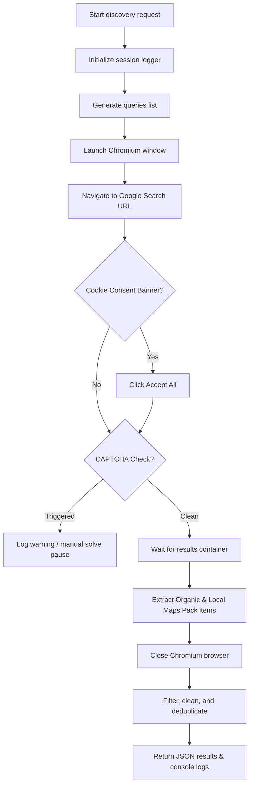

# Real competitor discovery engine (Playwright automation)

This document provides a beginner-friendly overview of how the **Real competitor discovery engine** works under the hood. 

To ensure the platform collects real-world business listings rather than synthetically generated listings, we have replaced AI mock systems with a browser-based crawling pipeline.

---

## 1. System architecture overview

The discovery engine follows a modular, single-responsibility structure:

1. **Query Generator** (`queryGenerator.js`): Takes the user's `brand`, `category`, and `location` and dynamically builds standard search phrases (e.g. `best gym in vikhroli`, `fitness center near vikhroli`).
2. **Google Search Runner** (`googleSearchRunner.js`): Spawns a real, visible Chromium browser context via **Playwright**, navigates to Google, accepts cookies, handles CAPTCHAs, and extracts raw page elements.
3. **Competitor Extractor** (`competitorExtractor.js`): Filters raw page elements. It removes paid ads, directory websites (like Yelp or TripAdvisor), and the user's own business brand.
4. **Data Cleaner** (`dataCleaner.js`): Sanitizes geographical suffixes (e.g. "Vikhroli West" -> "Gold's Gym"), normalizes casings, and eliminates duplicate entries.
5. **Search Logger** (`searchLogger.js`): Records every single step, browser status, and scraping count, returning a complete terminal session log to show in the frontend debug panel.

---

## 2. Playwright workflow details

### Why headful mode?
By default, headless browsers (browsers running with `headless: true`, meaning no visible window) are blocked by Google's anti-bot algorithms. To look like an organic human visitor, our scraper runs with:
- **`headless: false`**: Spawns a physical browser window on your desktop during the scan so you can visually verify Google is loading.
- **`slowMo: 300`**: Inserts a 300ms delay between actions (like clicking or typing), which mimics human interaction patterns.
- **Custom User Agent**: Emulates a standard desktop Google Chrome browser running on Windows 10.

### Browser execution flow

---

## 3. Data extraction & cleaning heuristics

### Local Maps Pack vs Organic Results
The Google Search Runner extracts two types of results from the search page:
1. **Google Local Pack (Maps 3-Pack)**: These are physical businesses highlighted on Google Search with star ratings, phone numbers, and website links.
   - *Selector*: `div.VkpGBb` matches the local card container.
   - *Logic*: We extract the business name inside `div[role="heading"]` and the outbound website link.
2. **Organic Listings**: These are traditional search links.
   - *Selector*: `div.g, div.tF23ub` matches search result blocks.
   - *Logic*: We extract `h3` for the title and `a` for the website link, ignoring links pointing back to Google.

### Filtering Directory Aggregators
To ensure the list only contains real, direct physical competitors (instead of directories compiling lists of competitors), the `competitorExtractor` checks website domains against a blacklist:
- Blocks social media channels: `facebook.com`, `linkedin.com`, `instagram.com`.
- Blocks generic registries: `yelp.com`, `justdial.com`, `tripadvisor.com`, `yellowpages.com`.
- Blocks info sites: `wikipedia.org`, `reddit.com`.

### Business Name Normalization
Google listings often append descriptions or locations (e.g. `Gold's Gym Vikhroli West - Gym in Mumbai`). The `dataCleaner` normalizes these into clean brands:
- Splits on standard delimiters (`-`, `|`, `:`, `–`) and takes the first portion.
- Removes word boundaries matching the target location (e.g. removes "Vikhroli", "Mumbai" from the name).
- Strips trailing directions ("West", "East").
- Caps spacing and normalizes punctuation, yielding a clean `Gold's Gym`.

---

## 4. Debugging strategy

The **Debug Panel** inside the frontend console renders active events in a terminal-like widget. This is fueled by `searchLogger.js` which registers:
- When Chromium launches or closes.
- What specific query is being crawls.
- How many raw elements were found per search.
- Any failed queries or rates blocks.

---

## 5. Current limitations & considerations

1. **CAPTCHA walls**: Google will occasionally challenge automated scrapers. If a verification challenge appears, our logger warns `[Browser] CAPTCHA verification wall detected. Waiting for manual verification...` and pauses for 5 seconds to let developers solve it or inspect the issue.
2. **Rate Limiting**: Querying Google too fast will cause temp blocks. We run queries **sequentially** (one after another) rather than in parallel to resemble organic behavior.
3. **Headful requirement**: Because it is headful, running this on a headless production server (like Ubuntu or AWS EC2 without a GUI desktop display) requires virtual framebuffers like `Xvfb`.

---

## 6. Future roadmap & scalability

- **Google Maps API Integration**: Transitioning to Google Places/Maps API once production scale is reached to avoid scraping blocks.
- **Proxy Rotation**: Introducing residential rotating proxy layers inside Playwright contexts to distribute searches across hundreds of human IP addresses.
- **Multi-Locality expansion**: Supporting multiple sub-district scans concurrently to create highly localized competitive GEO indexes.
