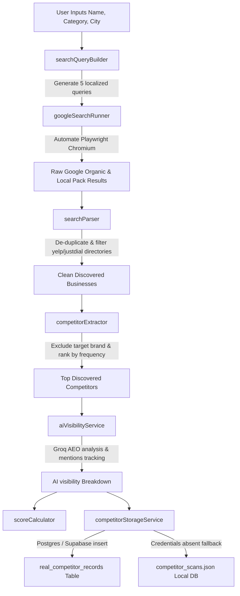

# Real-World Competitor Discovery & AI Visibility Pipeline

This document details the end-to-end architecture of the live, real-world competitor discovery and AI discoverability scoring pipeline integrated in Phase 2.

---

## Architecture Flow

The system coordinates a modular pipeline that replaces fake competitor generation with live local listings scraped directly from Google Search results.

---

## Pipeline Components Overview

### 1. Search Query Builder (`backend/search/searchQueryBuilder.js`)
Generates 5 distinct search phrases designed to match natural user queries for local verticals. Swaps category and city parameters dynamically:
- `best [category]s in [city]`
- `top [category] centers in [city]`
- `affordable [category] in [city]`
- `[category] near [city]`
- `best beginner [category] in [city]`

### 2. Google Search Automation (`backend/search/googleSearchRunner.js`)
Uses **Playwright browser automation** to perform real searches on Google:
- **Headed/Headless configuration**: Default headless operation inside servers, toggled by `SCRAPER_HEADLESS`.
- **Parallel execution protection**: Generates custom OS temporary directories for profile contexts to avoid Chromium parallel lock faults.
- **Race Condition Prevention**: Incorporates an `activeSearchPromises` mapping cache. If two routes request the same query in parallel (e.g. at the same millisecond from the dashboard), they join the *same single active scrape thread* instead of launching dual browser engines.
- **CookieConsent bypass**: Automatically identifies and clicks cookie consent overlays.
- **Resilient selectors**: Collects Google Local Maps cards and organic results. Captures: Title, Website URL, Star rating, Review count, Snippet, and Rank.

### 3. Google Search Parser (`backend/search/searchParser.js`)
Parses and normalizes scraped outputs:
- **Directory Filtering**: Automatically discards common aggregate portals (Yelp, Justdial, Tripadvisor, Facebook, LinkedIn, Zomato, swiggy, etc.) to extract *only actual local physical venues*.
- **Domain Normalizer**: Extracts the clean domain name (e.g. `goldsgym.in`) from websites to detect brand identity.

### 4. Competitor Extractor (`backend/search/competitorExtractor.js`)
- Excludes the user's own business.
- Sums the query citations count (mentions frequency).
- Calculates the average search position rank.
- Sorts competitors descending by mentions frequency, ascending by average rank, and yields the top 4 physical competitors.

### 5. AI Visibility Assessment (`backend/services/aiVisibilityService.js`)
Executes the **AI Discoverability Check** *after* real competitor discovery:
- Passes the target brand and discovered real competitors to **Groq LLM** using a structured prompt.
- Asks the AI: "If a customer queries LLMs for recommendations, which of these specific brands appear, what is their mention frequency (0-5), average recommendation position, and what are their strengths/weaknesses?"
- In the event of API downtime, falls back to a deterministic hashing algorithm that returns reproducible, consistent local metrics.

### 6. Database Storage (`backend/services/competitorStorageService.js`)
- Attempts to insert the discovered competitor profiles, websites, query sources, rankings, and AI frequencies directly into the Supabase PostgreSQL table `real_competitor_records`.
- If credentials are placeholders (as in development), persistently writes the JSON log to `backend/data/competitor_scans.json` to guarantee local state persistence.

---

## Frontend Integration

The React dashboard incorporates multiple features to communicate real-world data trust to users:
1. **Source Trust Badge**: Renders the emerald badge `"Data sourced from live Google search"` prominently on the Scorecard and Competitor Gap views.
2. **Real Competitor Websites**: Direct hyperlinks to competitive domains are displayed next to their names.
3. **Scraper Accordion Log**: Replaces raw mockup texts with live crawler status logs representing query parameters and parsed ranks.

---

## Limitations & Anti-Bot Strategy

- **Google Scraping Limits**: Google actively rate-limits concurrent browser crawls.
- **Anti-Bot Spoofing**: Playwright uses custom human-like user-agents and small delays (`slowMo`) to mimic organic user behavior.
- **10-minute Caching**: Scraped queries are cached in-memory for 10 minutes to minimize browser execution overhead and prevent IP bans.
- **Heuristic Fallbacks**: If scraping is completely blocked or capped, the scoring engine falls back smoothly to reproducible mock states to prevent system crashes.
