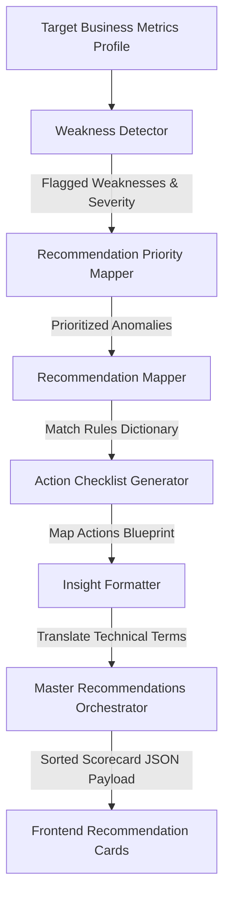

# AI Discoverability Platform - Recommendation Engine Handbook

Welcome to the technical handbook for the **Phase 5 Recommendation Engine**. This document explains the internal modular architecture, rule thresholds, priority mapping logic, action blueprint dictionaries, and future LLM integration strategies for generating business-friendly, actionable optimization playbooks.

---

## 1. Design Philosophy: From Analytics to Action

An analytics platform that merely highlights scores leaves users feeling overwhelmed. The core mission of the **Recommendation Engine** is to answer:
> *"What concrete, sequential tasks must I execute today to get AI engines to recommend my business tomorrow?"*

### Architecture Constraints & Guidelines
1. **Rule-Based & Explainable**: No complex LLM or black-box neural networks are used yet. Calculations and detections are fully deterministic and based on clear, transparent heuristics.
2. **Business-Oriented Language**: Technical indicators (e.g., *low website Domain Authority score*) are translated into plain-English business consequences (*"AI models cannot verify your business location authority because your backlink signals are weak"*).
3. **Structured & Checklist-Driven**: Every recommendation produces a step-by-step checklist with interactive checkbox items (e.g., generating FAQ JSON-LD schemas, setting up Google reviews QR codes, engaging on Reddit) to maximize user engagement.

---

## 2. Modular Sub-Systems & Pipeline Topology

The engine runs a sequential processing pipeline to scan a brand's metrics profile, identify weaknesses, map them to central solutions, and order the resulting playbook by urgency.



### Pipeline Sequence
1. **`weaknessDetector.js`**: Sweeps brand metrics against strict heuristic thresholds. Flags severity as `HIGH` (critical) or `MEDIUM` (moderate).
2. **`recommendationRules.js`**: Provides the structural templates, problem statements, and base solutions for each weakness category.
3. **`recommendationPriority.js`**: Translates detector severity ratings into sorting weights (`HIGH` priority maps first).
4. **`actionGenerator.js`**: Attaches a checklist of 3 distinct, practical, step-by-step optimization tasks for each category.
5. **`insightFormatter.js`**: Translates technical values and thresholds into non-technical, highly explainable customer statements.
6. **`recommendationMapper.js`**: Combines all pieces into unified advisory blocks.
7. **`recommendationEngine.js`**: Orchestrates the loop, filters out inactive categories, and delivers a sorted list of recommendations.

---

## 3. Heuristic Thresholds & Weakness Rules

The `weaknessDetector.js` module evaluates 7 key brand signals against defined bounds:

| Metric Parameter | Critical Bound (HIGH Severity) | Moderate Bound (MEDIUM Severity) | Monitored Weakness Category |
| :--- | :--- | :--- | :--- |
| **AI Citations/Mentions** | `< 1` query mention | `< 2` query mentions | `LOW_MENTIONS` |
| **AI Recommendation Rank** | Average Position `> 3.5` | Average Position `> 2.0` | `POOR_RANKING` |
| **Star Rating** | Star rating `< 4.2` | Star rating `< 4.5` | `LOW_RATING` |
| **Reviews Volume** | `< 300` reviews | `< 900` reviews | `FEW_REVIEWS` |
| **Schema FAQs** | `0` FAQ structured pages | `< 6` FAQs or no FAQ schema | `MISSING_FAQ` |
| **Website Authority** | Domain Authority (DA) `< 40` | Domain Authority (DA) `< 50` | `WEAK_AUTHORITY` |
| **Reddit Discussion Citations** | `< 5` social citations | `< 15` social citations | `WEAK_COMMUNITY_SIGNALS` |

---

## 4. Playbook Dictionaries & Action Blueprints

When a weakness is flagged, the engine maps it to standard optimization solutions and draws concrete action items from our checklist blueprint database:

### A. AI Visibility (`LOW_MENTIONS` / `POOR_RANKING`)
*   **Problem Statement**: Brand has low visibility or ranks deep in AI recommendations.
*   **Fix Action**: Boost search discoverability via high-authority indexing.
*   **Action Checklist**:
    1. Submit your business profiles to premium high-authority local business citations (Yelp, TripAdvisor, Google Maps, Bing Places).
    2. Audit search keyword alignments in your website's main headers (H1, H2) and title tags.
    3. Monitor Perplexity search recommendations weekly to track ranking index changes.

### B. Customer Reviews (`LOW_RATING` / `FEW_REVIEWS`)
*   **Problem Statement**: Competitors carry higher review credibility signals.
*   **Fix Action**: Expand local review velocity and customer satisfaction ratings.
*   **Action Checklist**:
    1. Print custom table tents or stickers with QR codes linking customers directly to your Google Maps review form.
    2. Set up automated post-service customer emails or SMS campaigns requesting honest feedback.
    3. Respond to all existing negative and neutral reviews within 24 hours to signal customer care.

### C. Website SEO Authority (`WEAK_AUTHORITY`)
*   **Problem Statement**: Search engines find it difficult to crawl and trust your core website.
*   **Fix Action**: Enhance technical domain authority index and backlink profiles.
*   **Action Checklist**:
    1. Establish backlink collaborations by partnering with local business associations and popular city blogs.
    2. Ensure full SSL security setup across all domain routes (redirect all HTTP pages to HTTPS).
    3. Optimize page speed and mobile responsiveness metrics to maximize search index ranking scores.

### D. Structural FAQs (`MISSING_FAQ`)
*   **Problem Statement**: Lack of question-answer structures makes it hard for LLMs to scrape direct answers.
*   **Fix Action**: Inject FAQ schemas into your website to seed AI citation platforms.
*   **Action Checklist**:
    1. Create a dedicated `/faqs` help center answering top customer pricing and amenity questions.
    2. Generate and embed clean `FAQPage` JSON-LD schema headers inside your website's root index.
    3. Register and submit your updated sitemap.xml directly to Google Search Console.

### E. Social / Community Signals (`WEAK_COMMUNITY_SIGNALS`)
*   **Problem Statement**: Lack of mentions across organic forums like Reddit and Quora.
*   **Fix Action**: Expand organic community citations in regional forums.
*   **Action Checklist**:
    1. Monitor popular local and category subreddits daily for recommendation requests.
    2. Participate naturally in forum discussions without spamming promotional outbound links.
    3. Pitch to boutique local lifestyle guides and niche review subreddits to generate organic recommendations.

---

## 5. UI Presentation & Interactive State Model

To offer a premium, modern experience, the frontend includes standard visual optimizations:
- **Tailored Badges**: Priorities are marked using HSL colors (`HIGH` is crimson rose, `MEDIUM` is warm amber, `LOW` is cool emerald).
- **Interactive Checkbox State**: In `RecommendationCard.js`, we initialize local state:
  ```javascript
  const [checkedStates, setCheckedStates] = useState(
    new Array(actions.length).fill(false)
  );
  ```
  This allows users to click items inside the checklist, dynamically triggering line-through strikethroughs on completed tasks without requiring immediate database read/write roundtrips.

---

## 6. Scaling to AI-Generated Recommendations (Phase 6 Preview)

The engine's JSON output format is specifically designed to support effortless future LLM scaling.

```json
{
  "success": true,
  "business": "Gold's Gym",
  "recommendations": [
    {
      "category": "Reviews",
      "problem": "Few Reviews",
      "recommendation": "Boost Google Review count",
      "priority": "HIGH",
      "impact": "Improves local search authority and AI citation rate.",
      "insight": "Your business only has 240 reviews. Competitors average 920. AI crawlers favor locations with high review volume.",
      "actions": [
        "Create stickers with Google review QR codes.",
        "Launch an automated post-service email campaign.",
        "Respond to all reviews to increase engagement."
      ]
    }
  ]
}
```

### Transitioning to Live LLMs in Phase 6:
To transition from rule-based scoring to AI-generated insights, we can modify the controller handler (`backend/controllers/recommendationController.js`):
1. **Remove Heuristic Dictionaries**: Retain the `weaknessDetector.js` to identify precisely where the brand is lacking.
2. **Inject OpenAI API Prompt**: Send the flagged weaknesses, current metrics, and competitor scores to OpenAI's Chat Completions API with a highly structured system prompt.
3. **Dynamic Response Validation**: Instruct the model to return the exact JSON schema defined above, producing highly customized, creative optimization playbooks tailored specifically to the target brand's niche and location.
