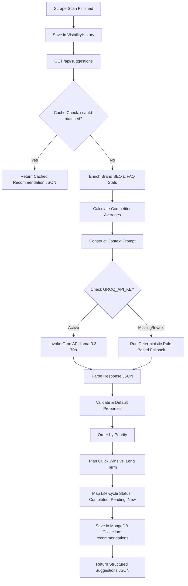

# AI Improvement Recommendation Engine - Technical Specifications

This documentation details the architecture, prompt design, caching layers, and database structures of the **AI Improvement Recommendation Engine (Phase 10)**.

---

## 1. Architectural Design

The engine follows a modular, decoupled pipeline architecture where data passes through sequential parsing, scoring, caching, and lifecycle-mapping layers before entering the frontend:

```mermaid
graph TD
    A[Scrape Scan Finished] --> B[Save in VisibilityHistory]
    B --> C[GET /api/suggestions]
    C --> D{Cache Check: scanId matched?}
    D -- Yes --> E[Return Cached Recommendation JSON]
    D -- No --> F[Enrich Brand SEO & FAQ Stats]
    F --> G[Calculate Competitor Averages]
    G --> H[Construct Context Prompt]
    H --> I{Check GROQ_API_KEY}
    I -- Active --> J[Invoke Groq API llama-3.3-70b]
    I -- Missing/Invalid --> K[Run Deterministic Rule-Based Fallback]
    J --> L[Parse Response JSON]
    K --> L
    L --> M[Validate & Default Properties]
    M --> N[Order by Priority]
    N --> O[Plan Quick Wins vs. Long Term]
    O --> P[Map Life-cycle Status: Completed, Pending, New]
    P --> Q[Save in MongoDB Collection: recommendations]
    Q --> R[Return Structured Suggestions JSON]
```

### Module Breakdown (`backend/ai-recommendations/`)

1. **`groqClient.js`**: Thin wrapper around the OpenAI-compatible Axios connection to issue chat completions targeting `llama-3.3-70b-versatile`.
2. **`promptBuilder.js`**: Gathers all quantitative metrics for both the target business and competitor profiles and serializes them into a clean markdown structure.
3. **`responseParser.js`**: Cleans up formatting anomalies (such as markdown wraps) and parses the raw text into JSON.
4. **`priorityCalculator.js`**: Enforces strict sorting priorities: High -> Medium -> Low.
5. **`recommendationValidator.js`**: Validates the presence of mandatory properties, applying realistic defaults if fields are empty.
6. **`improvementPlanner.js`**: Dynamically groups tasks into Quick Wins vs. High-Impact initiatives.
7. **`recommendationEngine.js`**: Orchestrates prompt building, completion calls, parsing, validation, and holds the rule-based fallback generator.
8. **`recommendationService.js`**: Connects the controller to the database layer, checking the caching registry, retrieving past scan trends, and performing history tag comparisons.

---

## 2. Prompt Engineering Design

To minimize AI hallucination and keep recommendations aligned strictly to factual business statistics, the system utilizes a **Structured Context Injection** strategy.

### Context Composition
Instead of a simple prompt, a markdown payload is constructed representing:
- **Core profiles**: Business name, category, and city.
- **Visibility scores**: Overall indexes and ChatGPT, Gemini, and Perplexity breakdowns.
- **Review signals**: Business rating and reviews count vs. competitor averages.
- **Authority signals**: Domain authority, keyword presence, and SSL availability.
- **Content FAQ structures**: FAQ page presence, FAQ count vs. competitor average, and schema markers.
- **Community citations**: Organic Reddit mention rates.
- **Historical scans**: Dynamic list of previous scan dates and overall visibility values.

### Prompt System Directives
The system instructions enforce:
- **Role Definition**: Act as an AI Discoverability Consultant.
- **Factual Grounding**: Rely strictly on the injected context. Never invent competitor details.
- **Zero Sponsored Actions**: Do not suggest paid ads (e.g. Google Ads). Focus entirely on organic discovery.
- **Technical Translation**: Explain metric gaps in plain business consequences.
- **Strict Schema Enforcement**: Require valid JSON conforming to the structural parameters.

---

## 3. Caching Strategy

To minimize API cost and guarantee performance, a double-caching layer is registered:
1. **Scope Caching**: When a user retrieves suggestions, the service checks if a recommendations record already exists associated with the user's latest `scanId` in the `recommendations` collection. If the scan ID matches, it returns the cached record immediately, saving API token resources.
2. **Deterministic Fallback**: If `GROQ_API_KEY` is not present, or if the API endpoint stalls or triggers rate limits, the orchestrator automatically activates a rule-based fallback calculation, ensuring the Suggestions page is 100% operational with data-driven recommendations.

---

## 4. Database Schema Structure

The recommendation results are stored in the Mongoose `recommendations` collection:

| Field Name | Type | Description |
| :--- | :--- | :--- |
| `userId` | `ObjectId` | Reference to the owner's `User` profile. |
| `businessName` | `String` | Core target business name. |
| `scanId` | `ObjectId` | Reference to the scan log in `VisibilityHistory`. |
| `summary` | `String` | Textual description of visibility strengths/weaknesses. |
| `overallHealth` | `String` | Level indicator (`Poor`, `Fair`, `Good`, `Excellent`). |
| `recommendations` | `Array` | Complete playbook recommendations containing problem, reason, priority, impact, time, and status. |
| `roadmap` | `Array` | Dynamic 6-week checklist timeline. |
| `quickWins` | `Array` | Easy, low-effort optimization recommendations. |
| `longTermImprovements`| `Array` | High-impact, strategic optimizations. |
| `competitorComparison`| `Array` | Stars ratings comparing reviews, website quality, and visibility. |
| `expectedImprovements`| `Object` | Progression of ChatGPT, Gemini, and Perplexity visibility scores. |
| `generatedDate` | `Date` | Timestamp of when the playbook was generated. |

---

## 5. Life-Cycle State Comparison

To track improvement progression over time (Step 11), a status mapping algorithm compares new playbooks against previously saved recommendations:
- **`New`**: A recommendation is labeled `New` if the problem was not present in the last recommendations scan.
- **`Pending`**: A recommendation is labeled `Pending` if it continues to be generated in the latest scan (meaning the business has not yet corrected the underlying deficiency).
- **`Completed`**: A recommendation is labeled `Completed` if it was present in the last scan but is no longer generated (meaning the business successfully corrected the deficiency!).

---

## 6. Limitations & Future Improvements

- **Local Execution Timeouts**: Scoring and scraper execution cycles can take up to 20-30 seconds depending on scraper speed. Future cycles can benefit from background jobs/WebSockets.
- **API Scalability**: In production environments, Groq calls can be wrapped in queue managers to handle high concurrency rates and mitigate rate limits.
